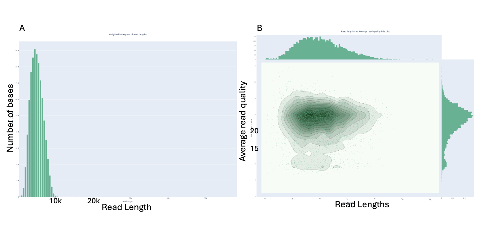
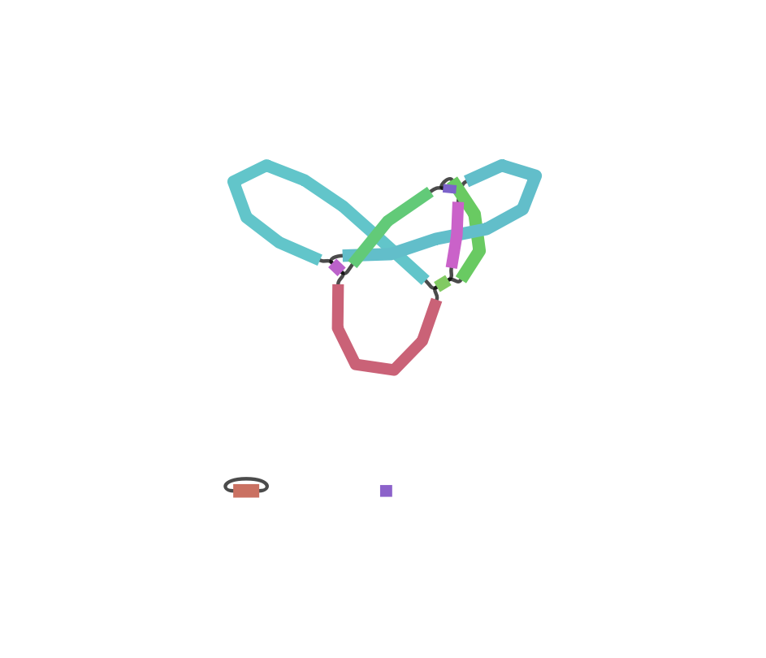
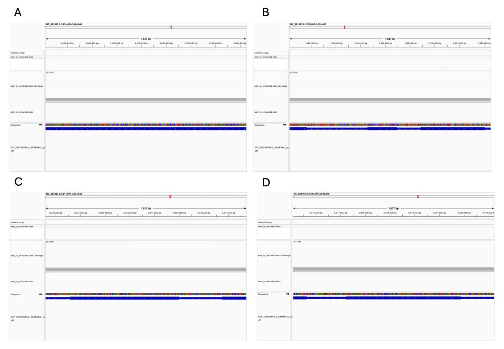

# BINF*6110 Assignment 1
## Introduction

Whole-genome assembly and reference-based genome comparison are fundamental tasks in bioinformatics and are widely applied in microbial genomics, pathogen surveillance, and evolutionary studies (Quainoo et al., 2017). The goal of this assignment is to assemble a consensus genome of *Salmonella enterica* from raw Oxford Nanopore sequencing reads and to compare the assembled genome to a reference genome obtained from NCBI through alignment and variant analysis.

*Salmonella enterica* is a bacterial pathogen of major public health importance and has a relatively small (approximately 5 Mb), haploid genome, making it well suited for de novo genome assembly using long-read sequencing data (Li et al., 2021). Bacterial genomes typically lack the extensive repetitive content and ploidy complexity found in many eukaryotic genomes, allowing assembly strategies to focus primarily on read length, sequencing accuracy, and coverage rather than phasing or large-scale scaffolding (Zadesenets et al., 2017).

Next-generation sequencing technologies are commonly divided into short-read and long-read platforms, each with distinct advantages and limitations. Short-read sequencing technologies, such as Illumina, produce highly accurate reads that enable precise base-level analyses but often result in fragmented assemblies due to their limited read length, particularly in repetitive genomic regions (Whiteford et al., 2005). In contrast, long-read sequencing technologies, including Oxford Nanopore Technologies (ONT), generate reads that span several kilobases, enabling improved assembly contiguity and resolution of structural features (Kim et al., 2024). However, long-read sequencing data are generally characterized by higher per-base error rates, particularly insertions and deletions, which can affect consensus accuracy if not properly addressed (Amarasinghe et al., 2020).

Recent improvements in ONT chemistry and basecalling accuracy have made long-read-only genome assembly increasingly feasible for bacterial genomes, provided that appropriate assembly and alignment methods are used (Zhang et al., 2021). Long-read assemblers reconstruct genomes by identifying overlaps between reads to generate contiguous sequences, but sequencing errors can still lead to misassemblies or incorrect consensus sequences, highlighting a trade-off between structural completeness and base-level accuracy (Bzikadze et al., 2022).

Reference-based alignment provides a complementary approach for evaluating genome assemblies and identifying genetic differences relative to a known reference (Liu et al., 2018). Modern aligners typically use heuristic strategies, such as k-mer-based seeding followed by local alignment extension, to efficiently compare large sequences (Shaw & Yu, 2023). While these methods are computationally efficient, alignment accuracy can be influenced by sequencing errors, repetitive regions, and reference bias, which must be considered when interpreting variant calls (Freeman et al., 2020).

In this assignment, a long-read genome assembly approach is combined with reference-based alignment and visualization to compare an assembled *Salmonella enterica* genome to a reference sequence. This workflow highlights the practical trade-offs between sequencing technology, assembly strategy, and alignment-based comparison, while providing hands-on experience with commonly used bioinformatics tools.


## Methods

Raw sequencing reads will be provided in FASTQ format and generated using Oxford Nanopore sequencing with R10 chemistry. FASTQ files contain both nucleotide sequences and per-base quality scores, allowing for initial assessment of sequencing quality prior to genome assembly. Read quality and length distributions will be examined using NanoPlot (v1.46.2) to ensure that the data are suitable for long-read assembly and to identify potential issues such as excessive short or low-quality reads (De Coster & Rademakers, 2023).No read trimming or filtering will be applied unless initial quality assessment indicates substantial low-quality signal, in which case default parameters will be used.

De novo genome assembly will be performed using Flye (v2.9.6), a long-read assembler designed for noisy sequencing data produced by Oxford Nanopore platforms (Kolmogorov et al., 2020). Assembly will be carried out using the ```--nano-raw``` option, which is appropriate for raw Nanopore reads, and an estimated genome size of approximately 5 Mb based on known *Salmonella enterica* genomes. All other parameters will be left at their default values. This approach balances assembly contiguity with computational efficiency and is well suited for bacterial genomes.

The draft assembly will be compared to a reference genome for *Salmonella enterica* obtained from the NCBI RefSeq database in FASTA format. The assembled genome will be aligned to the reference using minimap2 (v2.30), an aligner optimized for long-read and assembly-to-reference comparisons (H. Li, 2018). Alignments will be generated using the ```-ax asm5``` preset, which is recommended for aligning assembled contigs to a reference genome, and stored in SAM/BAM format for downstream analysis (H. Li, 2018). Alignment files will be processed using samtools (v1.23) for sorting and indexing (Danecek et al., 2021).

Differences between the assembled genome and the reference genome, including single-nucleotide variants and small insertions or deletions, will be identified using bcftools (v1.23) based on the alignment results (Danecek et al., 2021). Variant calls and alignments will be visualized using Integrative Genomics Viewer to inspect read coverage, alignment quality, and regions of divergence (Robinson et al., 2011). Visualization will be used to assess assembly accuracy and to support interpretation of observed differences between the assembled genome and the reference.


## Results

### Long-read quality assessment and genome assembly


**Figure 1. Quality assessment of Oxford Nanopore sequencing reads using NanoPlot.**
**(A)** Weighted histogram of read lengths showing that the majority of sequencing yield is contributed by mid-length reads, with an N50 consistent with expectations for R10 Nanopore chemistry. **(B)** Joint distribution of read length and average basecall quality, visualized as a kernel density estimate with marginal distributions, indicating relatively stable read quality across a wide range of read lengths.


Raw Oxford Nanopore sequencing reads were first evaluated using NanoPlot (v1.46.2) to assess read length distribution and basecall quality prior to assembly (Figure 1). The dataset consisted of approximately 196,000 reads, generating a total yield of ~809 Mb. Read lengths were centered around several kilobases, with an N50 of ~4.7 kb, consistent with expectations for R10 Nanopore chemistry. Quality metrics indicated that the majority of reads exceeded Q15, with a substantial fraction above Q20, suggesting that the dataset was of sufficient quality for downstream long-read assembly.

Genome assembly was performed using Flye (v2.9.6), resulting in a draft assembly composed of a small number of contigs with consistently high sequencing coverage. The total assembly size was approximately 5.2 Mb, comparable to the expected genome size of *Salmonella enterica*, indicating that most of the genome was successfully reconstructed. Coverage across contigs generally exceeded 130×, providing strong support for assembly accuracy and consensus reliability.


**Figure 2. Flye assembly graph of the *Salmonella enterica* genome.**
Nodes represent assembled contigs, with connections indicating overlaps inferred during assembly. The graph shows a largely simple structure with minimal branching, suggesting limited fragmentation and no obvious large-scale assembly artifacts.


Assembly continuity and structural integrity were further assessed by visualizing the Flye assembly graph using Bandage (v.0.9.0) (Wick et al., 2015) (Figure 2). The graph exhibited a relatively simple structure with minimal branching and no extensive unresolved repeat-induced tangles, suggesting limited fragmentation and no obvious large-scale assembly artifacts. Together, read-level quality assessment, assembly statistics, and graph-based inspection indicate that the long-read data supported a robust draft genome assembly suitable for downstream comparison with a reference genome.

### Comparison to reference genome and variant calling

To evaluate assembly accuracy, the assembled genome was aligned to the *Salmonella enterica* RefSeq reference genome (GCF_000006945.2) using minimap2 (v2.30) with the asm5 preset. The resulting alignment demonstrated broad concordance between the draft assembly and the reference genome, with 97.48% of reference bases covered by at least one alignment as assessed by samtools coverage. Mapping quality was consistently high (mean MAPQ = 60), indicating reliable alignments across the genome. Together, these results support strong overall concordance between the assembled contigs and the reference genome.

Variant calling using bcftools (v1.23) identified a total of 1,156 sequence variants, the vast majority of which were single-nucleotide polymorphisms (SNPs), with only a small number (2) of insertions or deletions (indels). This distribution is consistent with expectations for comparisons between closely related bacterial strains, where SNPs dominate over structural changes.

### Conservation of key virulence-associated genes


**Figure 3. IGV visualization of coding sequences for selected virulence-associated genes in *Salmonella enterica.***
Genome browser views show the alignment of the draft assembly to the reference genome at loci corresponding to key virulence-related genes: (A) invA; (B) msgA; (C) hilC and (D) hilD.


To assess the biological relevance of observed variants, coding sequences of key virulence-associated genes were examined in detail, including invA, msgA, and the SPI-1 regulatory genes hilC and hilD. IGV visualization of these loci (Figure 3) showed continuous coverage across their coding regions with no frameshift mutations or disruptive nonsynonymous variants.

The coding sequences of all four genes appeared intact and highly conserved relative to the reference genome, indicating preservation of their canonical protein structures in the assembled genome.


## Discussion
In this study, long-read Oxford Nanopore sequencing data were used to generate a draft genome assembly of *Salmonella enterica* and to evaluate its concordance with a well-annotated RefSeq reference genome. Overall, the results demonstrate that the long-read data supported a robust assembly that closely resembles the reference genome at both the structural and sequence levels, while still capturing biologically meaningful differences between the sample and the reference strain.

Assessment of the assembly against the reference genome revealed strong overall concordance. Alignment of the assembled contigs using minimap2 showed that approximately 97.5% of the reference genome was covered by at least one alignment, with consistently high mapping quality scores. This high degree of coverage indicates that the majority of the reference genome was successfully reconstructed in the draft assembly, and that large-scale structural discrepancies are unlikely. The small fraction of uncovered regions may reflect strain-specific variation, unresolved repetitive elements, or limitations inherent to long-read assembly, particularly in regions with complex genomic architecture.

Variant calling further highlighted the relationship between the assembled genome and the reference. Although over one thousand variants were identified, the majority were located outside annotated coding regions, suggesting that most sequence differences occur in intergenic or regulatory regions rather than within protein-coding genes. This pattern is consistent with expectations for closely related bacterial strains, where core genes tend to be highly conserved while non-coding regions tolerate greater sequence variation. The relatively low number of variants overlapping coding sequences indicates that the essential genetic framework of the organism remains largely intact.

To assess the biological relevance of the observed variants, several well-characterized virulence-associated genes were examined in detail, including invA, msgA, and the SPI-1 regulatory genes hilC and hilD. These genes play central roles in host cell invasion, intracellular survival, and regulation of virulence gene expression in *Salmonella enterica* (Liu et al., 2024, 2024; Lucas & Lee, 2001). Visualization of these loci in IGV revealed continuous coverage and high-quality alignments across their coding sequences, with no obvious disruptive variants detected. The absence of clear frameshift or truncating mutations in these genes suggests that their core functions are likely preserved in the assembled genome, consistent with previous studies highlighting the evolutionary conservation of key virulence determinants in Salmonella.

Taken together, these findings indicate that the assembled genome closely resembles the reference genome while still exhibiting sequence-level variation that may reflect strain-specific differences. The combination of high reference coverage, reliable variant calls, and preservation of key virulence gene coding sequences supports the conclusion that the draft assembly is of sufficient quality for downstream comparative and functional analyses. More broadly, this study illustrates how long-read sequencing and reference-based comparison can be effectively integrated to evaluate assembly accuracy and to contextualize genomic variation within a biologically meaningful framework for *Salmonella enterica*.


## References
Amarasinghe, S. L., Su, S., Dong, X., Zappia, L., Ritchie, M. E., & Gouil, Q. (2020).   
Opportunities and challenges in long-read sequencing data analysis.   
*Genome Biology, 21*(1), 30.         
https://doi.org/10.1186/s13059-020-1935-5  

Bzikadze, A. V., Mikheenko, A., & Pevzner, P. A. (2022).   
Fast and accurate mapping of long reads to complete genome assemblies with VerityMap.   
*Genome Research, 32*(11–12), 2107–2118.       
https://doi.org/10.1101/gr.276871.122  

Danecek, P., Bonfield, J. K., Liddle, J., Marshall, J., Ohan, V., Pollard, M. O., Whitwham, A., Keane, T., McCarthy, S. A., Davies, R. M., & Li, H. (2021).   
Twelve years of SAMtools and BCFtools.   
*GigaScience, 10*(2), giab008.   
https://doi.org/10.1093/gigascience/giab008  

De Coster, W., & Rademakers, R. (2023).   
NanoPack2: Population-scale evaluation of long-read sequencing data. *Bioinformatics, 39*(5), btad311.   
https://doi.org/10.1093/bioinformatics/btad311  

Freeman, T. M., Wang, D., & Harris, J. (2020).   
Genomic loci susceptible to systematic sequencing bias in clinical whole genomes.   
*Genome Research, 30*(3), 415–426.   
https://doi.org/10.1101/gr.255349.119 

Galán, J. E., Ginocchio, C., & Costeas, P. (1992). 
Molecular and functional characterization of the Salmonella invasion gene invA: Homology of InvA to members of a new protein family. 
*Journal of Bacteriology, 174*(13), 4338–4349. 
https://doi.org/10.1128/jb.174.13.4338-4349.1992

Kim, C., Pongpanich, M., & Porntaveetus, T. (2024).   
Unraveling metagenomics through long-read sequencing: A comprehensive review.   
*Journal of Translational Medicine, 22*(1), 111.   
https://doi.org/10.1186/s12967-024-04917-1  

Kolmogorov, M., Bickhart, D. M., Behsaz, B., Gurevich, A., Rayko, M., Shin, S. B., Kuhn, K., Yuan, J., Polevikov, E., Smith, T. P. L., & Pevzner, P. A. (2020).   
metaFlye: Scalable long-read metagenome assembly using repeat graphs.   
*Nature Methods, 17*(11), 1103–1110.   
https://doi.org/10.1038/s41592-020-00971-x  

Li, C., Tyson, G. H., Hsu, C.-H., Harrison, L., Strain, E., Tran, T.-T., Tillman, G. E., Dessai, U., McDermott, P. F., & Zhao, S. (2021).   
Long-Read Sequencing Reveals Evolution and Acquisition of Antimicrobial Resistance and Virulence Genes in Salmonella enterica.   
*Frontiers in Microbiology, 12*.   
https://doi.org/10.3389/fmicb.2021.777817  

Li, H. (2018). Minimap2: Pairwise alignment for nucleotide sequences.   
*Bioinformatics, 34*(18), 3094–3100.   
https://doi.org/10.1093/bioinformatics/bty191  

Liu, W., Wu, S., Lin, Q., Gao, S., Ding, F., Zhang, X., Aljohi, H. A., Yu, J., & Hu, S. (2018).   
RGAAT: A Reference-based Genome Assembly and Annotation Tool for New Genomes and Upgrade of Known Genomes.   
*Genomics, Proteomics & Bioinformatics, 16*(5), 373–381.   
https://doi.org/10.1016/j.gpb.2018.03.006

Liu, X., Wang, C., Gai, W., Sun, Z., Fang, L., & Hua, Z. (2024). 
Critical role of msgA in invasive capacity and intracellular survivability of Salmonella. 
*Applied and Environmental Microbiology, 90*(9), e0020124. 
https://doi.org/10.1128/aem.00201-24

Lucas, R. L., & Lee, C. A. (2001). 
Roles of hilC and hilD in regulation of hilA expression in Salmonella enterica serovar Typhimurium. 
*Journal of Bacteriology, 183*(9), 2733–2745. 
https://doi.org/10.1128/JB.183.9.2733-2745.2001

Narm, K.-E., Kalafatis, M., & Slauch, J. M. (2020). 
HilD, HilC, and RtsA Form Homodimers and Heterodimers To Regulate Expression of the Salmonella Pathogenicity Island I Type III Secretion System. 
*Journal of Bacteriology, 202*(9), e00012-20. 
https://doi.org/10.1128/JB.00012-20

Quainoo, S., Coolen, J. P. M., van Hijum, S. A. F. T., Huynen, M. A., Melchers, W. J. G., van Schaik, W., & Wertheim, H. F. L. (2017).   
Whole-Genome Sequencing of Bacterial Pathogens: The Future of Nosocomial Outbreak Analysis.   
*Clinical Microbiology Reviews, 30*(4), 1015–1063.   
https://doi.org/10.1128/cmr.00016-17  

Robinson, J. T., Thorvaldsdóttir, H., Winckler, W., Guttman, M., Lander, E. S., Getz, G., & Mesirov, J. P. (2011).   
Integrative genomics viewer.   
*Nature Biotechnology, 29*(1), 24–26.   
https://doi.org/10.1038/nbt.1754  

Shaw, J., & Yu, Y. W. (2023).   
Proving sequence aligners can guarantee accuracy in almost O(m log n) time through an average-case analysis of the seed-chain-extend heuristic.   
*Genome Research, 33*(7), 1175–1187.   
https://doi.org/10.1101/gr.277637.122  

Whiteford, N., Haslam, N., Weber, G., Prügel-Bennett, A., Essex, J. W., Roach, P. L., Bradley, M., & Neylon, C. (2005).   
An analysis of the feasibility of short read sequencing.   
*Nucleic Acids Research, 33*(19), e171.   
https://doi.org/10.1093/nar/gni170 

Wick, R. R., Schultz, M. B., Zobel, J., & Holt, K. E. (2015). 
Bandage: Interactive visualization of de novo genome assemblies. 
*Bioinformatics, 31*(20), 3350–3352. 
https://doi.org/10.1093/bioinformatics/btv383

Zadesenets, K. S., Ershov, N. I., & Rubtsov, N. B. (2017).   
Whole-genome sequencing of eukaryotes: From sequencing of DNA fragments to a genome assembly.   
*Russian Journal of Genetics, 53*(6), 631–639.   
https://doi.org/10.1134/S102279541705012X  

Zhang, P., Jiang, D., Wang, Y., Yao, X., Luo, Y., & Yang, Z. (2021).   
Comparison of De Novo Assembly Strategies for Bacterial Genomes.   
*International Journal of Molecular Sciences, 22*(14), 7668.   
https://doi.org/10.3390/ijms22147668


